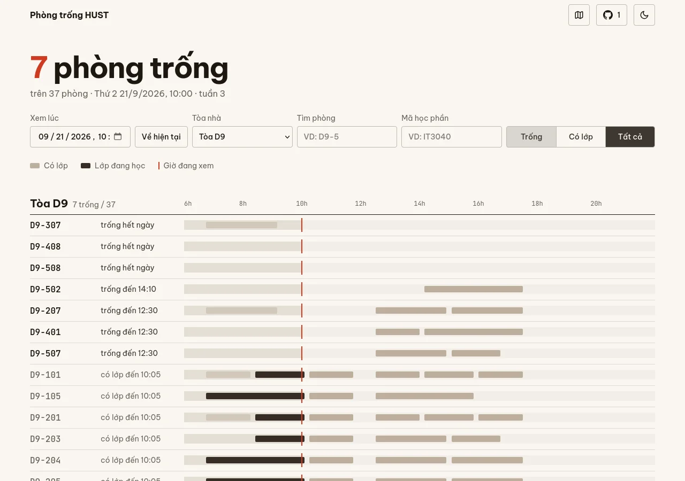
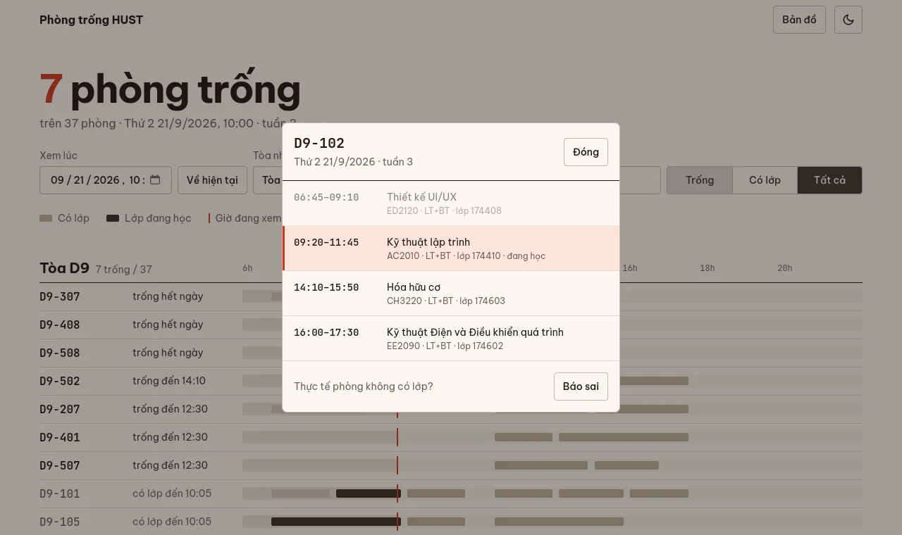
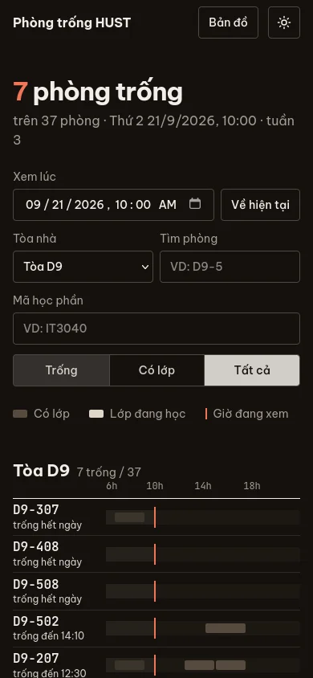
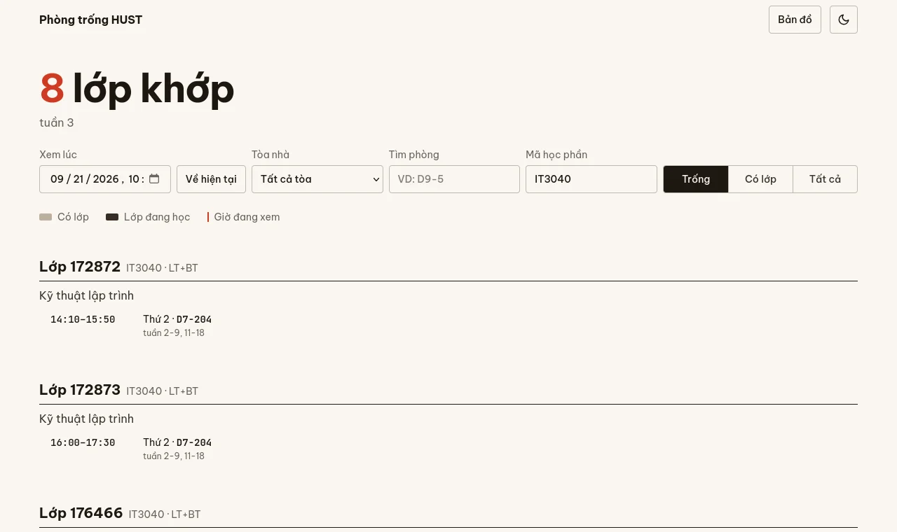

# Phòng trống HUST

Xem nhanh phòng học nào ở Bách khoa đang có lớp và phòng nào đang trống, dựa trên thời khóa biểu kỳ 20261.

**Dùng ngay:** https://ledangquangdangquang.github.io/wswg/



## Tính năng

- Số phòng trống ngay lúc này, tự cập nhật mỗi phút.
- Mỗi phòng ghi rõ "Trống · đến 14:10" hoặc "Đang học · đến 11:45", kèm tên môn.
- Bấm vào một phòng để xem lịch cả ngày của phòng đó.
- Gõ mã học phần (ví dụ `IT3040`) để xem các lớp của môn đó học thứ mấy, giờ nào, phòng nào.
- Nút **Bản đồ** mở bản đồ trường để tìm tòa nhà.
- Thấy app báo sai thì bấm **Báo sai** trong lịch phòng. Nút này mở một GitHub Issue điền sẵn phòng, giờ, app báo gì và thực tế ra sao (cần tài khoản GitHub). Danh sách báo sai xem ở [Issues](https://github.com/ledangquangdangquang/wswg/issues?q=%5BB%C3%A1o+sai%5D).
- Chọn giờ khác trong ô "Xem lúc" để xem trước, ví dụ chiều mai phòng nào trống.
- Lọc theo tòa nhà, tìm theo mã phòng (ví dụ `D9-5`), lọc theo Trống / Đang học.
- Giao diện sáng hoặc tối: mặc định theo hệ thống, đổi được bằng nút mặt trời / mặt trăng trên thanh đầu trang.

<p align="center">
  
  
</p>



## Chạy ở máy

Mở thẳng `index.html` bằng trình duyệt là chạy được, không cần cài gì và không cần server.

## Cập nhật thời khóa biểu

1. Chép file TKB `.xlsx` của trường vào thư mục này, giữ nguyên, không cần chuyển sang định dạng khác.
2. Chạy:
   ```sh
   python3 build_data.py "TKB20261-FULL.xlsx"   # không truyền tên file thì lấy file TKB* mới nhất
   ```
   Lệnh này tạo lại `data.js`. Chỉ cần Python 3, không phải cài thêm thư viện. Kỳ và ngày cập nhật được đọc tự động từ dòng tiêu đề của file.
3. Chỉ khi **sang năm học mới** (ngày bắt đầu tuần 1 thay đổi) mới cần thêm `--week1`:
   ```sh
   python3 build_data.py --week1 2027-09-06   # thứ Hai của tuần 1
   ```
   Những lần sau script tự dùng lại ngày này. Không cần sửa `index.html`.
   Script cũng in ra các tuần thi nó đoán được. Kiểm tra lại, sai thì thêm `--exam-weeks`.
4. Commit rồi push lên `main`. GitHub Pages sẽ tự cập nhật sau khoảng một phút.

## Cách tính

- Tuần hiện tại được tính từ ngày bắt đầu tuần 1 (năm học 2026–2027: thứ Hai 07/09/2026). Một phòng bị coi là "đang học" nếu có lớp đúng thứ, đúng tuần và đúng khung giờ.
- Chỉ tính phòng học có mã dạng Tòa-Số (D9-102, C7-E303, C10B-205…). Sân, SVĐ, bể bơi và lớp Online không được tính.
- Lớp bị huỷ được bỏ qua.
- **Tuần thi** (kỳ 20261: tuần 10, 19, 20) vẫn hiện phòng như bình thường, nhưng có thêm cảnh báo rằng phòng báo trống có thể đang dùng để thi. Script tự đoán tuần thi là những tuần có ít lớp. Đoán sai thì chạy lại với `--exam-weeks 10,19-20`.
- Nếu thời điểm đang xem nằm ngoài các tuần có trong TKB (trước khi vào kỳ hoặc sau khi hết kỳ), app hiện cảnh báo thay cho danh sách phòng, không báo "trống hết".
- App chỉ biết những gì có trong TKB. Họp, thi hay mượn phòng đột xuất không có trong dữ liệu, nên "trống" chỉ có nghĩa là không có lớp theo lịch.

## Cấu trúc

| File | Vai trò |
| --- | --- |
| `index.html` | Toàn bộ giao diện (HTML + CSS + JS) |
| `data.js` | Dữ liệu sinh từ file TKB, không sửa tay |
| `build_data.py` | Chuyển file TKB thành `data.js` |
| `TKB*.xlsx` | Thời khóa biểu gốc |
| `maps-hust.webp` | Bản đồ trường |
| `screenshots/` | Ảnh minh họa cho README |
